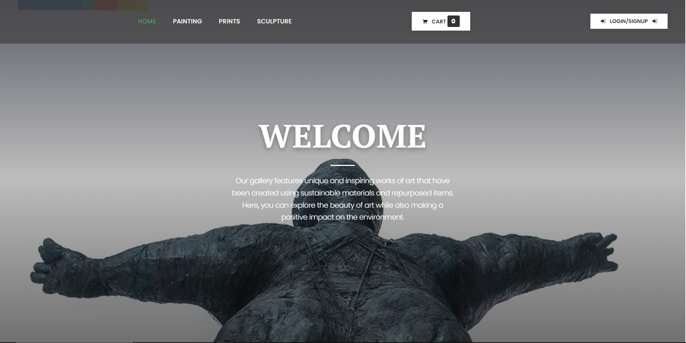

# Artsvert- Only recycle project limit protfolio project 3weeks 🥇

  

## Artsvert
: is an online platform that aims to promote recycling and sustainability by providing a virtual gallery where users can showcase and trade recycled or upcycled art and craft items.
## role
: The platform will connect artists, designers, and individuals interested in eco-friendly creations, creating a community focused on recycling and creativity.

## Architecture

  

## Home page

 
 

 
4. Data Modelling

Key Features:
User Registration and Profiles:
Users can create accounts with basic information and profile pictures.
Users can provide additional details about their interests and expertise in recycling and upcycling.
Item Listing:
Users can list their recycled or upcycled art and craft items for sale or trade.
Each listing includes a title, description, images, price (or trade preference), and shipping details.
Users can categorize their items based on different art forms, materials used, or sustainability themes.
Search and Filter:
Users can search for specific items based on keywords, categories, or artists' names.
Filter options are available to narrow down search results by price range, location, or other relevant criteria.
Item Detail Page:
Each item has a dedicated page displaying its images, description, price/trade preference, and shipping details.
Users can view the seller's profile, including their bio and other listed items.

Basic Admin Dashboard:
An admin dashboard allows administrators to manage user accounts, items, moderate listings, etc...
Responsive Design:
The platform is designed to be accessible and user-friendly on various devices, including desktops, tablets, and mobile phones.

### Authors
<a href="https://github.com/8srael" >Kouassi</a> & <a href="https://github.com/Bboy010" >Hongo</a>

:accessibility:
==Alx-portfolio-project== 
